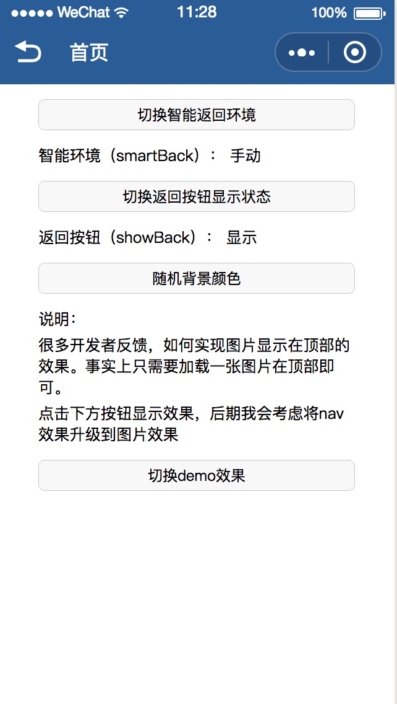
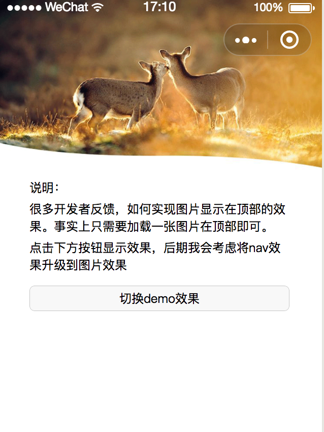

# 效果：





#  如何查看demo

### 1.直接使用开发者打包文件：
####  下载dist文件夹，用微信开发工具打开

### 2.自行编译
```console
  npm install
``` 
```console
  npm run build
``` 
####  然后将dist文件夹用微信开发工具打开


# inaver导航栏组件参数说明：

### 说明：引用该导航栏，请设置navigationStyle: 'custom',同时尽可能检测微信版本是否高于6.6.0，以便更好的显示和交互

## 传入参数

#### background 
##### String 
##### 默认值：#353535 
##### 十六进制颜色 

#### colorTheme 
##### String 
##### 默认值：white 
##### 可选，black、white 

#### showBack 
##### Boolean 
##### 默认值：true 
##### 是否显示返回按钮 

#### toBack 
##### Boolean 
##### 默认值：true 
##### 点击返回按钮执行返回 

#### checkCompatibility 
##### Boolean 
##### 默认值：true 
##### 兼容性检测，判断微信版本是否支持，不支持则不显示 

#### protectCapsule 
##### Boolean 
##### 默认值：true 
##### 保护胶囊，不被污染；取消可扩大显示区域 

#### samrtBack
##### Boolean 
##### 默认值：true 
##### 自动判断是否显示返回按钮，必须同时配合showBack为true使用

## slot

#### slot="main" 大小及区域受showBack、protectCapsule影响

## 方法

#### back   通过 @back.user="" 绑定
##### 备注： toBack设置为false时，可通过上述方法监听返回，判断是否需要返回上一级


##### 补充说明：字体颜色及背景颜色设置，请同步app内window设置【使得状态栏样式保持一致】；


## 闲言碎语
#### 微信的这个功能，事实上很多开发者只在某些特定的页面、特定的情境下才会用到。但目前这个参数设置却是全局的。这就意味着如果使用。那么就要模拟其他的所有导航栏

